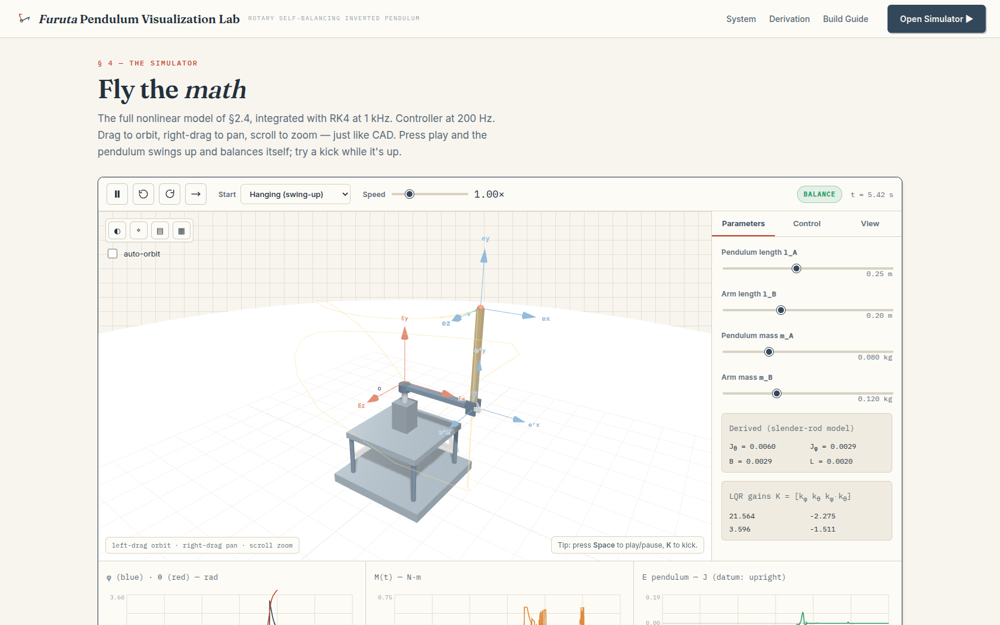

# Furuta Pendulum Lab

A fully self-contained, offline-capable **interactive simulator, derivation and build guide** for a
rotary self-balancing inverted (Furuta) pendulum, with an **LQR** balance controller and an
energy-based swing-up.



## What's inside

The site is **five static pages**: a landing page plus one page per section, all reachable
from the navbar.

| Page | Section | What it does |
|---|---|---|
| `index.html` | — | Landing page: hero copy and the live 3D figure of the rig |
| `system.html` | **§1 The System** | The rig: rotary arm B (length `l_B`) driven by `M(t)` about the vertical, pendulum A (length `l_A`) hinged at the arm tip; notation & bases `{E}`, `{e′}`, `{e}` |
| `derivation.html` | **§2 Derivation** | Full equations of motion via Lagrange, in the exact notation of `main.tex` — bases, kinematics, energy, EoMs, matrix form `M q̈ + C q̇ = τ`, linearization & **LQR** design, energy swing-up |
| `build.html` | **§3 Build Guide** | Physical blueprint, electronics, control FSM, firmware pseudocode and the phased tuning procedure from the project notes |
| `simulator.html` | **§4 Simulator** | 3D CAD-style viewport (drag to orbit, right-drag to pan, wheel to zoom), RK4 @ 1 kHz, controller @ 200 Hz, live LQR gain computation, swing-up → balance FSM, charts, telemetry, disturbance kicks, sensor noise |

Each page loads only the JavaScript it needs: pages with a 3D figure pull in three.js,
and `js/simulator.js` runs only on `simulator.html`. `js/physics.js` and `js/main.js`
(KaTeX, navbar, scroll-reveal, SVG figures) load everywhere.

## Run it locally

No build step, no server required (it even works offline). Any of:

```bash
# clone, then just open the file
git clone <your-repo-url> furuta-pendulum
cd furuta-pendulum
# simplest:
xdg-open index.html        # or double-click in your file manager

# or serve it (recommended — cleanest behaviour):
python3 -m http.server 8000
# then visit http://localhost:8000
```

Everything is vendored in the repo: three.js, OrbitControls, KaTeX and all fonts
(`lib/`). Nothing is fetched from a CDN at runtime.

## Editing the site

There is no build step: edit a file, save, refresh the browser.

- **Section text, headings, figures** live in the page for that section (`system.html`, `derivation.html`, …).
- **Colours, fonts and spacing** are the CSS variables at the top of `css/style.css`.
- **Simulator defaults** (gains, torque limit, pump mode) are the `params`/`ctrl` blocks at the top of `js/simulator.js`; slider ranges are in `simulator.html`.
- **SVG diagrams** (basis figure, blueprint, LQR block diagram) are generated in `js/main.js`, not written in the HTML.
- **Navbar and footer** are *not* shared: the same markup is copied into all five pages, so a change
  means editing each one. The navbar is the one part that must stay in sync — the e2e suite fails
  loudly if a page's nav links or `.active` marking drift.

## Using the simulator

1. **Play ▶** — start from *Near-upright* (balance) or *Hanging* (watch the swing-up pump the pendulum
   to the top and catch it).
2. **Kick** — disturb the pendulum while it balances and watch the LQR recover. (Space = play/pause,
   `K` = kick, `R` = reset.)
3. **Parameters tab** — change lengths/masses; the LQR gains **recompute live** from the linearization.
4. **Control tab** — tune the LQR weights `Q`, `R`, the swing-up pump (`k_E`, bang-bang vs
   proportional), torque limit and capture zone. Add sensor noise to see how the velocity LPF helps.
5. **View tab** — toggle bases, angle arcs, gravity, velocity, torque, trail and the ground grid;
   snap the camera to isometric/top/front/side views.

## Sign conventions (important when building the real thing)

With the basis convention of `main.tex` (`e′ = E rotated by θ about E₃`, `e = e′ rotated by φ about
e′₁`, `φ = 0` upright), the model gives:

- positive `M(t)` spins the arm counterclockwise viewed from above;
- the energy swing-up law is `M = −k_E·E·sgn(φ̇·cosφ)` — the arm accelerates *in the direction of the
  pendulum's swing* when energy is lacking (see the sign note in §2.6 of the site);
- the balance torque opposes the pendulum's lean, `M = −Kx`, with `K` from the LQR design. Verify
  your motor's wiring direction against this before applying power.

## Tests

The physics engine and the site are covered by four test suites:

```bash
# physics: EoMs vs raw Lagrange, energy conservation, LQR, swing-up, noise, hardware variants
node test/physics.test.js

# end-to-end (headless Chrome; requires puppeteer-core in test/e2e and a local server)
cd test/e2e && npm install

node site.test.js      # page loads, navbar/navigation, then the simulator interaction suite
node visual.test.js    # fonts, rendering/kinematics probes, camera controls
node stress.test.js    # long runs, sensor noise, extreme parameters, every UI control
```

Start a server first (e.g. `python3 -m http.server 8123` from the repo root) and point the
suites at it. All three accept the same environment variables:

| Variable | Default | Purpose |
|---|---|---|
| `SITE_URL` | `http://127.0.0.1:8123/` | Base URL; may be a directory or `index.html` |
| `CHROME` | `/usr/bin/google-chrome` | Chrome/Chromium binary for `puppeteer-core` |
| `SHOTS` | `shots` | Where the suites write their screenshots |

```bash
SITE_URL=http://127.0.0.1:8000/ node site.test.js
```

Because the site is multi-page, the suites navigate between pages: `site.test.js`
walks all five checking titles, figures, nav links and active-page marking, then
runs the simulator tests on `simulator.html`; `visual.test.js` probes the hero on
`index.html`, the §1 figure on `system.html`, and kinematics/charts/camera on
`simulator.html`. `npm test` runs `site.test.js` and `visual.test.js` only;
`stress.test.js` is not part of the default run because it takes a few minutes.

## Credits

Derivation and blueprint after the project notes (`main.tex`). Built as a teaching prototype —
three.js for the 3D scene, KaTeX for the math, paper and ink from the VectorDyn design language.
